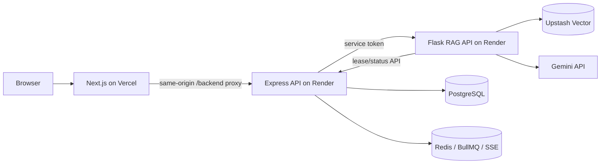
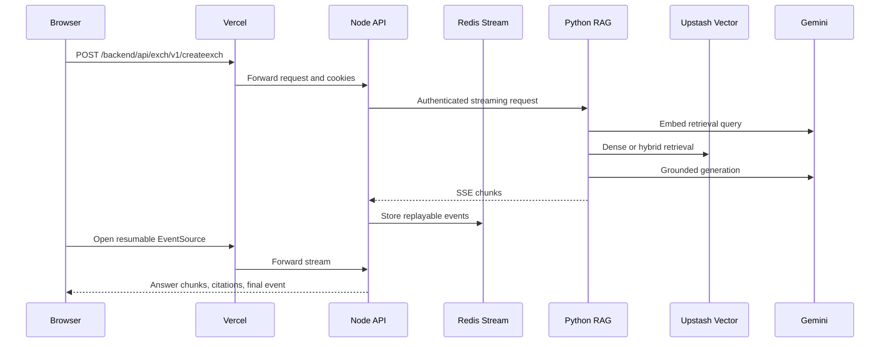

# NeuraNexus

NeuraNexus is a full-stack retrieval-augmented generation platform. It combines
a Next.js client, an Express control plane, and a Flask RAG data plane with
Gemini generation and embeddings, PostgreSQL state, Redis queues/streams, and
Upstash Vector retrieval.

This repository is suitable for development, evaluation, and a free hobby
deployment. The free deployment described below is not a production SLA: Render
free services sleep, share a monthly runtime allowance, and do not preserve
uploaded files.

## Architecture at a glance



The browser never calls Gemini, Upstash, PostgreSQL, Redis, or the Python
service directly. Vercel proxies `/backend/*` to the Node API so authentication
cookies remain first-party. Node owns identity, authorization, conversations,
files, ingestion leases, and index releases. Python owns retrieval, confidence
gates, reranking, grounding, and vector operations.

### Query path



### Ingestion path

1. An administrator uploads a supported file to Node.
2. BullMQ performs bounded file processing and records the document in
   PostgreSQL.
3. The Python ingestion worker claims a fenced lease with `SKIP LOCKED`.
4. The worker extracts and chunks content, requests Gemini document embeddings,
   and writes deterministic vector IDs to Upstash.
5. Node accepts completion only from the current lease and index version.
6. Candidate indexes are evaluated before an atomic promotion or rollback.

## Components

| Directory | Responsibility | Runtime |
| --- | --- | --- |
| [`client`](client/README.md) | Chat, citations, auth UI, admin files/users | Next.js 15 / React 19 |
| [`node_server`](node_server/README.md) | Public API, JWT cookies, PostgreSQL, queues, SSE, index control | Node.js / Express / Prisma |
| [`python_server`](python_server/README.md) | Gemini embeddings and generation, retrieval, evaluation, ingestion | Python / Flask |
| [`.github/workflows/quality.yml`](.github/workflows/quality.yml) | Client, Node, Prisma, and Python quality gates | GitHub Actions |
| [`render.yaml`](render.yaml) | Render Blueprint for both backend web services | Infrastructure as code |

## RAG engineering features

- Gemini `gemini-embedding-001` embeddings with separate document and query
  task types, configurable 768-dimensional output, batching, retries, and
  normalization.
- Dense retrieval or hybrid dense/sparse retrieval with stateless lexical
  hashing, server-side IDF weighting, reciprocal-rank fusion, and optional
  cross-encoder reranking.
- Tenant-aware `GLOBAL` and owner-scoped `PRIVATE` document filters applied to
  retrieval, citations, downloads, thumbnails, and filename resolution.
- Confidence scoring, insufficient-context refusal, citation extraction, and
  grounded streaming generation.
- Versioned physical indexes, per-document manifests, fenced ingestion leases,
  quality/latency promotion gates, and rollback coverage checks.
- Resumable SSE through Redis stream IDs, bounded reconnects, request IDs,
  structured retrieval logs, and Prometheus-format metrics.
- Offline relevance evaluation and concurrent retrieval load tests.

## Local development

### Prerequisites

- Node.js 22 and npm
- Python 3.11+ and [uv](https://docs.astral.sh/uv/)
- PostgreSQL
- Redis
- A Gemini API key
- An Upstash Vector index

### 1. Configure Python

```bash
cd python_server
cp env.example .env
uv sync --extra ingestion --extra reranking
uv run gunicorn --bind 0.0.0.0:5000 --workers 1 --threads 4 app:app
```

Set `RERANKER_ENABLED=false` for the lightweight lexical fallback. Set it to
`true` only after installing the `reranking` extra and budgeting memory for the
cross-encoder.

### 2. Configure Node

```bash
cd node_server
cp env.example .env
npm ci
npm run prisma:generate
npm run prisma:deploy
npm run build
npm start
```

The value of `INGESTION_SERVICE_TOKEN` must be identical in Node and Python.

### 3. Configure the client

```bash
cd client
cp env.example .env.local
npm ci
npm run dev
```

The local client uses its `/backend` rewrite, so cookies follow the same path
they use in production.

## Free deployment: Vercel + Render

### What is free and what is not guaranteed

The recommended hobby stack is:

| Capability | Free provider |
| --- | --- |
| Next.js frontend and proxy | Vercel Hobby |
| Node API and Python RAG API | Two Render free web services |
| PostgreSQL | Prisma Postgres Free or Neon Free |
| Redis protocol endpoint | Upstash Redis Free |
| Vector search | Upstash Vector Free |
| LLM and embeddings | Gemini API Free tier, subject to project quotas |

Important constraints:

- Vercel Hobby is for personal, non-commercial use.
- Render free web services have 512 MB RAM, sleep after 15 idle minutes, and
  share 750 running hours per workspace each month. Two active services consume
  that allowance twice as quickly.
- A cold request can wake Node and then Python. Open both health endpoints before
  a demo, and expect the first chat request to be slow or require one retry.
- Render free filesystems are ephemeral. Uploaded files disappear on sleep,
  restart, or deploy. PostgreSQL and Upstash vectors remain, but citation file
  downloads will not. Durable uploads require an object-store adapter (for
  example S3/R2), which this repository does not yet implement.
- The lightweight Render profile disables the local cross-encoder and does not
  run the heavyweight multimodal ingestion worker. Run ingestion locally or use
  paid worker compute with more memory.
- Free tiers are appropriate for a portfolio/demo environment, not production.

### Step 1: create the external services

1. Create a Gemini API key in Google AI Studio. Check the active free-tier
   limits for your project; quotas vary by model and project.
2. Create an Upstash Vector index with 768 dimensions and cosine distance.
   Start with a dense index and `HYBRID_SEARCH_ENABLED=false`. A hybrid index is
   required before enabling hybrid retrieval.
3. Create an Upstash Redis database and copy its TLS Redis URL. Use the
   `rediss://...` connection string, not the REST URL.
4. Create a free Prisma Postgres or Neon database and copy the pooled PostgreSQL
   connection string with TLS enabled.

Never commit these credentials.

### Step 2: deploy both backends on Render

1. Push this repository to GitHub.
2. In Render, choose **New → Blueprint**, connect the repository, and select the
   root [`render.yaml`](render.yaml).
3. Supply the secret values requested by the Blueprint:

   | Service | Variable | Value |
   | --- | --- | --- |
   | RAG | `GEMINI_API_KEY` | Google AI Studio key |
   | RAG | `UPSTASH_VECTOR_REST_URL` | Vector REST URL |
   | RAG | `UPSTASH_VECTOR_REST_TOKEN` | Vector token |
   | API | `DATABASE_URL` | Pooled PostgreSQL URL |
   | API | `REDIS_URL` | Upstash `rediss://` URL |
   | API | `PYTHON_SERVER_URL` | Expected RAG URL, then correct it after creation |
   | API | `CORS_ORIGINS` | Expected Vercel production URL |

   Render generates both JWT secrets and the shared service token. Python reads
   the shared token from the Node service definition.
4. Wait for `neuranexus-rag` to deploy. Copy its actual
   `https://...onrender.com` URL.
5. Set the Node service's `PYTHON_SERVER_URL` to that exact origin and redeploy
   Node. Its build runs `prisma migrate deploy` because Render pre-deploy commands
   are unavailable on free web services.
6. Verify:

```text
https://YOUR-RAG.onrender.com/api/health
https://YOUR-API.onrender.com/healthz
```

If a service name is already taken, Render changes its public hostname. Always
use the hostname shown in the dashboard.

### Step 3: deploy the frontend on Vercel

1. In Vercel, import the same Git repository.
2. Set **Root Directory** to `client` and keep the detected Next.js settings.
3. Add these Production environment variables:

```env
BACKEND_ORIGIN=https://YOUR-API.onrender.com
NEXT_PUBLIC_BASEURL=/backend
NEXT_PUBLIC_FILE_BASE_URL=/backend
```

4. Deploy and copy the final `https://YOUR-PROJECT.vercel.app` URL.
5. Return to the Render Node service, set `CORS_ORIGINS` to that exact Vercel
   origin, and redeploy Node.
6. Redeploy Vercel after any environment-variable change. Public Next.js values
   are embedded during the build.

Do not point `NEXT_PUBLIC_BASEURL` directly at Render. Keeping it as `/backend`
makes the Vercel rewrite a same-origin backend-for-frontend and lets strict,
secure HTTP-only cookies work without third-party-cookie exceptions.

### Step 4: create an administrator

1. Sign up through the deployed client.
2. Open Prisma Studio or your database console and change that user's `role`
   from `USER` to `ADMIN`.
3. Sign out and back in. The `/admin` route will now be available.

### Step 5: ingest documents for a free demo

Render's free Python web service installs only the lightweight query runtime.
Run the ingestion worker from a local machine while the Node service and its
uploaded file are awake:

```bash
cd python_server
uv sync --extra ingestion

API_URL=https://YOUR-API.onrender.com \
INGESTION_SERVICE_TOKEN=THE_RENDER_GENERATED_SHARED_TOKEN \
GEMINI_API_KEY=YOUR_GEMINI_KEY \
UPSTASH_VECTOR_REST_URL=YOUR_VECTOR_URL \
UPSTASH_VECTOR_REST_TOKEN=YOUR_VECTOR_TOKEN \
INDEX_VERSION=gemini-embed-001-768-v1 \
uv run python ingestion_worker.py
```

Upload from the admin dashboard after the worker is running. Stop the worker
after documents reach `COMPLETED`.

## Production upgrade path

Before serving real users:

1. Move Node and Python to always-on instances and run ingestion as an
   independent background worker.
2. Replace local upload storage with S3/R2/GCS and store object keys, not local
   filesystem paths.
3. Use managed PostgreSQL and Redis plans with backups, persistence, connection
   pooling, and alerting.
4. Enable the cross-encoder only on compute with sufficient memory, or use a
   hosted reranking service.
5. Put Node and Python on a private network; expose only Node through the
   frontend proxy.
6. Add centralized logs, metrics scraping, error tracking, rate-limit budgets,
   backup restoration drills, and staged index promotion/rollback exercises.

## Quality gates

```bash
cd client && npm run lint && npm run typecheck && npm run build
cd node_server && npm run build
cd python_server && uv run python -m unittest discover -s tests -v
```

For retrieval quality and load gates, see
[`python_server/README.md`](python_server/README.md).

## Official deployment references

- [Vercel monorepos](https://vercel.com/docs/monorepos)
- [Vercel Hobby plan](https://vercel.com/docs/plans/hobby)
- [Render Blueprints](https://render.com/docs/infrastructure-as-code)
- [Render free instance limits](https://render.com/docs/free)
- [Render Flask deployment](https://render.com/docs/deploy-flask)
- [Render Prisma deployment](https://render.com/docs/deploy-prisma-orm)
- [Gemini API rate limits](https://ai.google.dev/gemini-api/docs/rate-limits)
- [Prisma Postgres](https://www.prisma.io/docs/postgres)
- [Upstash Redis pricing](https://upstash.com/pricing/redis)
- [Upstash Vector documentation](https://upstash.com/docs/vector)
