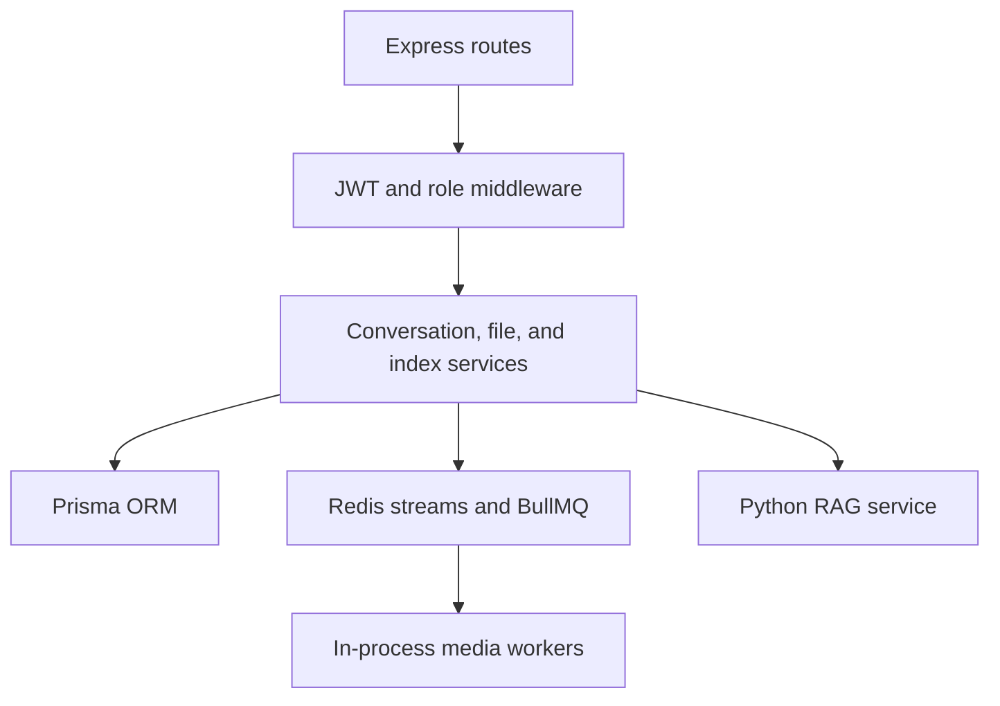

# NeuraNexus Node API

The Node service is the public control plane for NeuraNexus. Browsers reach it
through the frontend's same-origin `/backend` proxy. The Python RAG service is a
private application dependency authenticated with a shared bearer token.

## Responsibilities

- Sign-up, login, access/refresh cookies, logout, and admin authorization.
- Conversation and exchange persistence.
- Resumable server-sent events backed by Redis streams.
- File validation, processing queues, protected downloads, and thumbnails.
- PostgreSQL-backed ingestion leases with fencing and retry recovery.
- Document visibility enforcement across files, retrieval, and citations.
- RAG index candidate registration, evaluation gates, promotion, and rollback.

## Internal architecture



The current demo deployment starts the BullMQ media workers inside the API
process. At scale, split them into independent worker processes so API replicas
do not duplicate worker capacity and can scale separately.

## Requirements

- Node.js 22+
- PostgreSQL
- Redis 6+ or a managed TLS Redis endpoint
- The Python RAG service
- FFmpeg and other media utilities for the complete local processing path

## Local setup

```bash
cp env.example .env
npm ci
npm run prisma:generate
npm run prisma:deploy
npm run build
npm start
```

For iterative development, compile with `npm run build:watch` and run the built
server with the existing development script.

## Environment variables

Copy [`env.example`](env.example). Required variables are validated at startup.

| Variable | Required | Purpose |
| --- | --- | --- |
| `PORT` | Yes | HTTP listener; Render injects this automatically |
| `DATABASE_URL` | Yes | PostgreSQL/Prisma connection string |
| `REDIS_URL` | Recommended | `redis://` or TLS `rediss://` URL |
| `REDIS_HOST`, `REDIS_PORT` | Alternative | Local Redis when `REDIS_URL` is absent |
| `PYTHON_SERVER_URL` | Yes | Python service origin without a trailing path |
| `JWT_ACCESS_SECRET` | Yes | Access-token signing secret |
| `JWT_REFRESH_SECRET` | Yes | Separate refresh-token signing secret |
| `INGESTION_SERVICE_TOKEN` | Yes | Shared Node/Python service credential |
| `CORS_ORIGINS` | Yes in production | Comma-separated browser origins |
| `DOMAIN_NAME` | Optional | Public Node origin; Render falls back to `RENDER_EXTERNAL_URL` |
| `QUERY_REQUEST_TIMEOUT_MS` | Yes | Maximum downstream RAG/SSE idle duration |
| `IMAGE_MAX_SIZE` | Yes | Image upload limit in MB |
| `AUDIO_MAX_SIZE` | Yes | Audio upload limit in MB |
| `PDF_MAX_SIZE` | Yes | PDF upload limit in MB |
| `DOCUMENT_MAX_SIZE` | Yes | Office/text document upload limit in MB |
| `RAG_ACTIVE_INDEX_VERSION` | Recommended | Bootstrap index version before DB state exists |

Promotion thresholds in `env.example` are optional and have bounded defaults.

Generate independent secrets, for example:

```bash
openssl rand -base64 48
```

Never use a Gemini key as the service token and never expose any of these values
through a `NEXT_PUBLIC_*` variable.

## Authentication boundary

Production cookies are HTTP-only, secure, strict same-site, and scoped to `/`.
The Vercel frontend proxies API traffic through `/backend`, which keeps cookies
first-party even though Node runs on Render. Direct cross-origin frontend calls
are intentionally not the recommended deployment topology.

The frontend middleware performs an early cookie-presence redirect; every API
endpoint still verifies the signature, expiry, database user, and role.

## Main routes

All application routes are under `/api`.

| Prefix | Purpose |
| --- | --- |
| `/api/auth/v1` | Signup, login, refresh, logout, current user, admin promotion |
| `/api/conv/v1` | Conversation creation, listing, and title updates |
| `/api/exch/v1` | Exchanges and resumable response streams |
| `/api/file/v1` | Uploads, jobs, protected files, leases, reindexing |
| `/api/rag-index/v1` | Candidate evaluation, promotion, and rollback |

Liveness is available at `GET /healthz`. `GET /` returns basic service identity.

### Service-authenticated routes

Python uses `Authorization: Bearer <INGESTION_SERVICE_TOKEN>` for ingestion
claims, lease heartbeats, status updates, protected file access, and vector
index coordination. Use a constant-time comparison and rotate the value in both
services together.

### Resumable chat streaming

1. `POST /api/exch/v1/createexch` creates the exchange and response ownership
   record.
2. Node calls Python's streaming chat endpoint.
3. Events are appended to a Redis stream under the response ID.
4. `GET /api/exch/v1/stream-response/:responseId` verifies ownership and emits
   Redis IDs as SSE IDs.
5. Reconnecting clients send the last ID and receive only missing events.

## Database lifecycle

Use migrations in deployment environments:

```bash
npm run prisma:generate
npm run prisma:deploy
```

Use `prisma migrate dev` only when authoring a new migration locally. Do not use
`db push` for production schema changes.

The Render free Blueprint runs migrations in the build command because Render's
pre-deploy command is a paid-web-service feature. On an upgraded service, move
`npm run prisma:deploy` into the pre-deploy command.

## Redis and queues

`REDIS_URL` supports authenticated `redis://` and TLS `rediss://` endpoints.
BullMQ requires `maxRetriesPerRequest: null`, which is configured centrally.
Redis currently stores:

- BullMQ jobs and worker leases.
- Response ownership keys.
- Replayable SSE streams.
- Active RAG index cache state.

Free Redis is acceptable for a demo. Production Redis must persist queue state
and should have eviction, backup, monitoring, and failure policies suitable for
the workload.

## File-storage limitation

Files are currently written beneath `node_server/uploads`. Render free web
services use an ephemeral filesystem, so those files disappear on sleep,
restart, and deployment. PostgreSQL metadata and vectors do not recreate the
original file.

For production, implement an object-storage adapter and persist object keys.
Downloads and worker inputs should stream from that store rather than local
paths.

## Render deployment

The root [`render.yaml`](../render.yaml) defines this service with:

- Root directory: `node_server`
- Build: `npm ci && npm run prisma:generate && npm run prisma:deploy && npm run build`
- Start: `npm start`
- Health path: `/healthz`

Set `DATABASE_URL`, `REDIS_URL`, `PYTHON_SERVER_URL`, and `CORS_ORIGINS` in the
Render dashboard. The Blueprint generates the JWT and service secrets.

See the root [deployment runbook](../README.md#free-deployment-vercel--render)
for the required creation order and Vercel proxy settings.

## Verification

```bash
npm ci
npm run prisma:generate
npx prisma validate
npm run build
```

After deployment:

```bash
curl https://YOUR-API.onrender.com/healthz
```
