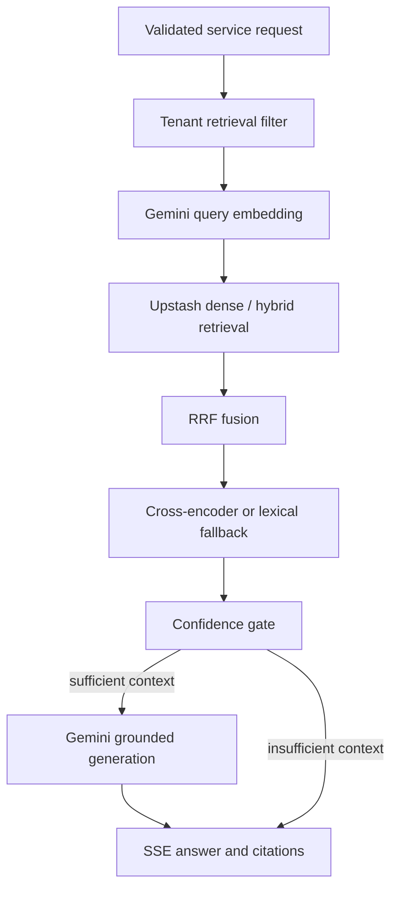

# NeuraNexus Python RAG service

The Python service is the RAG data plane. It is called by Node with a shared
service token and should not be exposed directly to browser application code.

## Responsibilities

- Gemini document/query embeddings and grounded text generation.
- Dense or hybrid Upstash Vector retrieval.
- Reciprocal-rank fusion and optional cross-encoder reranking.
- Retrieval confidence, refusal gates, citations, and streamed answers.
- Document ingestion with lease heartbeat and fenced completion.
- Version-aware vector deletion and index discovery.
- Retrieval metrics, structured request IDs, offline evaluation, and load tests.

## Query pipeline



## Runtime profiles

The dependency graph is split so the query API can fit a small demo instance.

| Profile | Install | Use |
| --- | --- | --- |
| Query API | `uv sync` | Gemini, Upstash retrieval, lexical reranking fallback |
| Reranking | `uv sync --extra reranking` | Adds Sentence Transformers cross-encoder |
| Ingestion | `uv sync --extra ingestion` | Adds document, image, audio, transformer, OCR, and Vosk dependencies |

`RERANKER_ENABLED=false` is the default. Enabling it without the `reranking` or
`ingestion` extra safely falls back to lexical reranking, but production should
treat a missing configured model as a deployment error.

The Render free Blueprint installs only the query API profile because its web
instances have 512 MB RAM. The full ingestion stack, PyTorch models, and
cross-encoder need larger worker compute.

## Local setup

```bash
cp env.example .env
uv sync --extra ingestion --extra reranking
uv run gunicorn --bind 0.0.0.0:5000 --workers 1 --threads 4 app:app
```

For the same lightweight profile used by Render:

```bash
uv sync
RERANKER_ENABLED=false uv run gunicorn --bind 0.0.0.0:5000 app:app
```

## Environment variables

Copy [`env.example`](env.example).

### Required

| Variable | Purpose |
| --- | --- |
| `GEMINI_API_KEY` | Server-side Gemini credential |
| `INGESTION_SERVICE_TOKEN` | Must match Node exactly |
| `UPSTASH_VECTOR_REST_URL` | Default physical vector index URL |
| `UPSTASH_VECTOR_REST_TOKEN` | Default vector index token |

### Model and retrieval configuration

| Variable | Default | Purpose |
| --- | --- | --- |
| `LLM_MODEL` | `gemini-2.5-flash` | Grounded generation model |
| `EMBEDDING_MODEL` | `gemini-embedding-001` | Query/document embedding model |
| `GEMINI_EMBEDDING_DIMENSIONS` | `768` | Must match the vector index |
| `GEMINI_EMBED_BATCH_SIZE` | `32` | Bounded embedding batch size |
| `GEMINI_TIMEOUT_MS` | `60000` | Gemini client timeout |
| `GEMINI_MAX_RETRIES` | `5` | Retry budget |
| `RERANKER_ENABLED` | `false` | Load the optional local cross-encoder |
| `INDEX_VERSION` | `text-v1` | Default logical/physical index version |
| `HYBRID_SEARCH_ENABLED` | `false` | Enable dense+sparse queries |
| `SPARSE_HASH_DIMENSIONS` | `2147483647` | Stateless sparse hash space |
| `HYBRID_DENSE_WEIGHT` | `1.0` | Dense contribution to RRF |
| `HYBRID_SPARSE_WEIGHT` | `1.0` | Sparse contribution to RRF |

`VECTOR_INDEXES_JSON` can map multiple release versions to physical indexes:

```json
{
  "text-v1": {
    "url": "https://...",
    "token": "secret",
    "hybrid": false
  },
  "hybrid-v2": {
    "url": "https://...",
    "token": "secret",
    "hybrid": true
  }
}
```

Treat the entire JSON value as a secret. Gemini vectors are not compatible with
vectors produced by Ollama/Nomic even when the dimension count matches; create
a new physical index and reingest before promotion.

## Service authentication

Every route except `GET /api/health` requires:

```http
Authorization: Bearer <INGESTION_SERVICE_TOKEN>
```

`/api/metrics` is intentionally service-authenticated because labels and
operational counts should not be public. The service accepts and returns
`X-Request-Id`; retrieval logs store a short question hash instead of raw user
text.

## API

| Method and path | Purpose |
| --- | --- |
| `GET /api/health` | Public liveness check |
| `POST /api/chat` | Non-streaming grounded response |
| `POST /api/chat/stream` | SSE grounded response |
| `GET /api/indexes` | Configured index versions without credentials |
| `DELETE /api/vectors/documents/:id` | Delete a document's vectors across configured indexes |
| `GET /api/metrics` | Prometheus-format retrieval counters and latency |

Node supplies `retrieval_scope` and the active `index_version`. Browser clients
must not construct those authorization fields directly.

## Ingestion worker

The ingestion worker is a separate long-running process:

```bash
uv sync --extra ingestion
uv run python ingestion_worker.py
```

It needs these additional values:

```env
API_URL=http://localhost:8000
LEASE_HEARTBEAT_SECONDS=120
```

The worker repeatedly:

1. Claims a bounded document lease from Node.
2. Downloads the protected source file with service authentication.
3. Extracts/chunks content and creates Gemini document embeddings.
4. Upserts deterministic vector IDs into the requested physical index.
5. Heartbeats during long work and completes using the same lease ID.

Never run more workers than the external API quotas and database lease settings
can support. On Render, background workers are not available on the free plan;
for a free demo, run this process locally as described in the root README.

## Retrieval evaluation

Run offline relevance evaluation against a running service:

```bash
INGESTION_SERVICE_TOKEN=... \
python -m evaluation.retrieval_eval evaluation/sample_dataset.jsonl \
  --base-url http://localhost:5000 \
  --index-version gemini-embed-001-768-v1
```

Compare a candidate against a baseline:

```bash
INGESTION_SERVICE_TOKEN=... \
python -m evaluation.retrieval_eval evaluation/sample_dataset.jsonl \
  --base-url http://localhost:5000 \
  --index-version hybrid-v2 \
  --baseline-version gemini-embed-001-768-v1
```

Run the concurrent error/latency gate:

```bash
INGESTION_SERVICE_TOKEN=... \
python -m evaluation.retrieval_load_test evaluation/sample_dataset.jsonl \
  --base-url http://localhost:5000 \
  --concurrency 8 --requests 100
```

The evaluation report includes hit rate, MRR, recall, precision, NDCG, error
rate, retrieval method, and latency percentiles. Submit the generated promotion
metrics to Node only after every candidate document has a current index
manifest.

## Render deployment

The root [`render.yaml`](../render.yaml) configures:

- Root directory: `python_server`
- Build: `uv sync --frozen --no-dev`
- Start: one Gunicorn worker with four threads
- Health path: `/api/health`
- `RERANKER_ENABLED=false`

One worker avoids loading multiple copies of the pipeline inside a 512 MB free
instance. Threads allow concurrent I/O while Gemini and Upstash requests are in
flight. Upgrade memory before enabling the local cross-encoder.

See the root [deployment runbook](../README.md#free-deployment-vercel--render).

## Verification

```bash
uv sync
uv run python -m unittest discover -s tests -v
```

Health check after deployment:

```bash
curl https://YOUR-RAG.onrender.com/api/health
```
